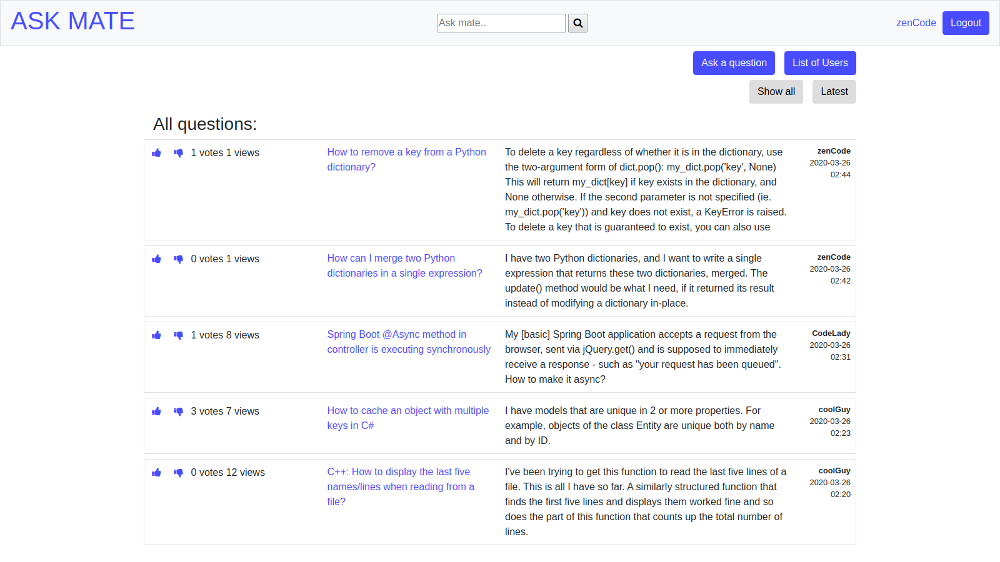
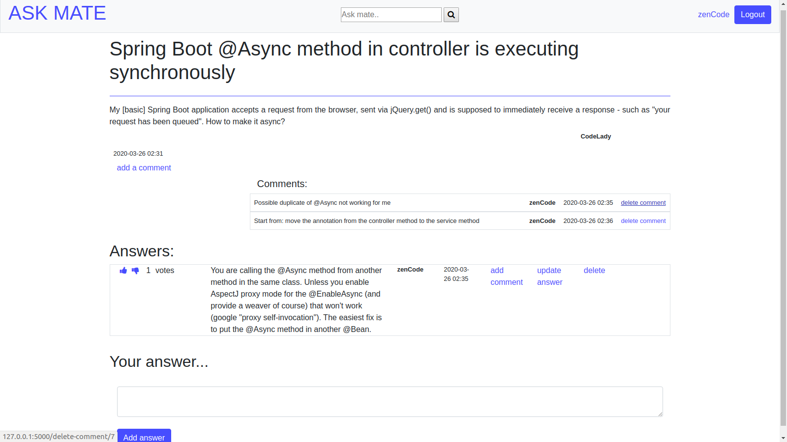

# Ask Mate
Web application based on StackOverflow forum. It allows to ask questions by users, give answers and comments. It's also possible to vote for the best answer. Created to practice MVC pattern, errors handling, logging. 

## Table of contents
* [General info](#general-info)
* [Technologies](#technologies)
* [Setup](#setup)
* [Screenshots](#screenshots)
* [Status](#status)
* [Contact](#contact)

## General info
AskMate:
* Shows on main page list of all questions
* gives possibility to add questions, answers and comments
* Login and registration functonality
* Voting system

## Technologies
* Python 3.7
* Flask
* PostgreSQL
* Bcrypt
* Html, CSS, Bootstrap

## Setup

## Screenshots

## Status
Project is finished.

## Contact
Created by [Weronika Walczak](mailto:weronikawalczak989@gmail.com) - feel free to contact me!
